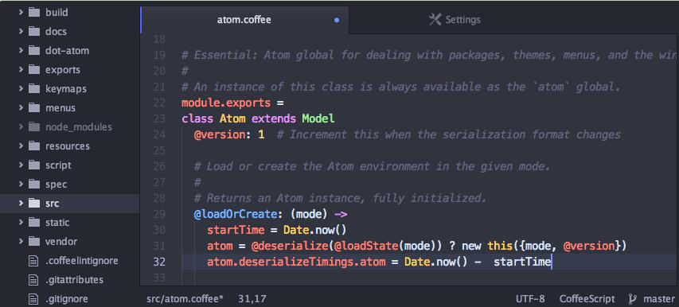
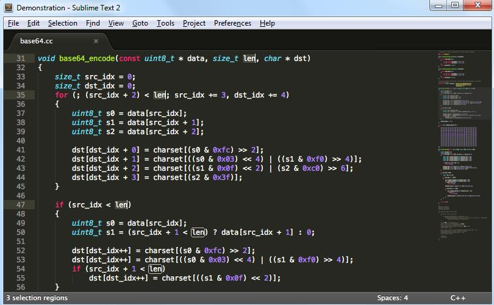

# 简介

> 工欲善其事,必先利其器  

选择合适好用的工具有助于我们提供编码的效率,下面推荐一些前端常用的工具

# 编码工具

## atom

#### 推荐安装插件


| 插件名        |         说明
| :-------------: |:-------------:
| atom-beautify       | 代码格式化插件
| autocomplete-paths  |自动补全路径
|file-icons| 直观的显示文件图标
|highlight-selected|高亮显示选中项
|Sublime-Style-Column-Selection|编辑时候多行选中
|emmet|更快的书写css
|language-vue|vue单文件代码高亮
|pretty-json|快速格式化json文件
|project-viewer|管理及快速切换各个项目

#### 参考资料  
官网: [访问](https://atom.io/)  
插件库: https://atom.io/packages/  
帮助文档: [atom飞行手册](https://wizardforcel.gitbooks.io/atom-flight-manual-zh-cn/content/)


## sublime


#### 推荐安装插件
首先必须安装插件管理器  
在命令行面板输入以下代码,按Enter
```
import urllib.request,os; pf = 'Package Control.sublime-package'; ipp = sublime.installed_packages_path(); urllib.request.install_opener( urllib.request.build_opener( urllib.request.ProxyHandler()) ); open(os.path.join(ipp, pf), 'wb').write(urllib.request.urlopen( 'http://sublime.wbond.net/' + pf.replace(' ','%20')).read())
```
|插件名|说明
|:------:|:-----:
|coverToUTF8|sublime中文编码支持
|all-autocomplete|编码自动提示
|AutoFileName|自动补全路径
|emmet|更快的书写css


#### 参考资料  
官网: [访问](https://www.sublimetext.com/)  

# npm(Node.js包管理工具)


npm包管理工具是nodejs工程化不可获取的工具,熟悉npm的常用用法,是现代前端工程师的一个基本技能,详细用法会在工程化的一节介绍

# 其他工具

## Node.js  

这个不解释了

## Q-Dir
便捷管理打开的各种文件夹

## everything
从电脑飞速的搜索文件

## svn
这个不解释了

## git
这个不解释了
